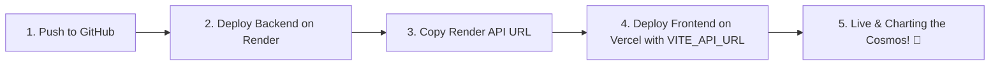

# Curiosity Machine — Production Deployment Guide (Option A)

This guide walks you through deploying **Curiosity Machine** using the recommended decoupled architecture:
- **Backend API**: Hosted on **Render** (Free Tier Web Service)
- **Frontend App**: Hosted on **Vercel** (Free Global Edge CDN)

Both platforms have generous free tiers requiring **zero paid credits**.

---

## 📋 Overview of Deployment Steps



---

## Step 1: Push Code to GitHub

Make sure all changes are pushed to your GitHub repository:
```powershell
git push origin main
```
Repository: `https://github.com/arpansanap1-stack/Curiosity_machine.git`

*(If Git prompts for credentials, complete the browser sign-in or use your GitHub Personal Access Token).*

---

## Step 2: Deploy Backend API on Render

1. Go to [Render.com](https://render.com) and sign in with GitHub.
2. In the Render Dashboard, click **New +** and select **Web Service**.
3. Choose **Build and deploy from a Git repository**, click **Next**, and connect your `Curiosity_machine` repository.
4. Configure the Web Service settings:
   - **Name**: `curiosity-machine-api` (or any name you choose)
   - **Region**: Choose the region closest to you (e.g., *Oregon (US West)* or *Frankfurt*)
   - **Branch**: `main`
   - **Root Directory**: Leave blank (default `.`)
   - **Runtime**: `Python 3`
   - **Build Command**: 
     ```bash
     pip install -r api/requirements.txt
     ```
   - **Start Command**:
     ```bash
     python -m uvicorn api.app.main:app --host 0.0.0.0 --port $PORT
     ```
   - **Instance Type**: Select **Free** ($0/month)

5. Scroll down to **Environment Variables** and add the following:

   | Key | Value | Description |
   |---|---|---|
   | `PYTHON_VERSION` | `3.11.9` | Pinned Python runtime |
   | `GEMINI_API_KEY` | `your_gemini_api_key` | Free Google AI Studio API key |
   | `GEMINI_MODEL` | `gemini-3.1-flash-lite` | Recommended fast, high-availability model |
   | `CORS_ORIGINS` | `*` | Allows requests from your Vercel frontend |
   | `RATE_LIMIT_PER_MINUTE` | `60` | Per-IP request throttle |
   | `FORCE_DEGRADED_MODE` | `false` | Fallback flag |

6. Click **Deploy Web Service**.
7. Once deployment finishes (usually 1–2 minutes), copy your Render service URL from the top of the dashboard.
   - Example URL: `https://curiosity-machine-api.onrender.com`
   - Test it by visiting: `https://curiosity-machine-api.onrender.com/api/health` in your browser. You should see `{"status":"ok", ...}`.

---

## Step 3: Deploy Frontend on Vercel

1. Go to [Vercel.com](https://vercel.com) and sign in with GitHub.
2. In your Vercel Dashboard, click **Add New...** → **Project**.
3. Select and **Import** your `Curiosity_machine` repository.
4. In the **Configure Project** screen:
   - **Project Name**: `curiosity-machine` (or custom name)
   - **Framework Preset**: `Vite` (automatically detected)
   - **Root Directory**: Click **Edit**, select the **`web`** folder, and click **Continue**.
   - **Build and Output Settings**: Defaults are pre-configured:
     - Build Command: `npm run build` (or `tsc -b && vite build`)
     - Output Directory: `dist`
5. Expand the **Environment Variables** section and add:

   | Key | Value |
   |---|---|
   | `VITE_API_URL` | `https://curiosity-machine-api.onrender.com` |

   *(Replace with your actual Render API URL from Step 2. You do not need to append `/api` — the frontend normalizer handles it automatically).*

6. Click **Deploy**.
7. Vercel will build and deploy your app globally in ~30 seconds. Click on the generated domain (e.g., `https://curiosity-machine.vercel.app`).

---

## Step 4: Verify Your Deployment

1. Visit your live Vercel URL.
2. Enter any curiosity prompt (e.g., *"Bioluminescence"*, *"Octopus intelligence"*, *"Quantum entanglement"*).
3. Verify that:
   - The knowledge universe canvas renders smoothly with stars, nebulae, and filaments.
   - Clicking a star opens the **Inspector Panel** with streamed prose and depth lenses (Simple / Student / Undergrad / Expert).
   - Double-clicking expands new neighbor concepts.
   - The **Rabbit Hole Drawer** discovers distant unexpected ideas with surprise scores.
   - The **Bridge Finder** successfully links two distant concepts.
   - The **Curiosity Profile** computes your explorer archetype and exports a share card.

---

## 💡 Free Tier Notes & Best Practices

1. **Render Free Tier Spin-Down**:
   - Render's free web services automatically spin down after 15 minutes of inactivity. When a new visitor arrives, the first request may take 30–50 seconds to wake up the backend. Subsequent requests are instant.
   - *Tip*: You can use a free uptime monitor (like [UptimeRobot](https://uptimerobot.com)) to ping `https://your-api.onrender.com/api/health` every 10 minutes if you wish to keep it warm continuously.

2. **Offline Resilience**:
   - Even if the Render backend spins down, the frontend caches previously explored universes in the visitor's local browser **IndexedDB**, allowing offline universe exploration.

3. **Updating Your Code**:
   - Every time you run `git push origin main`, both Vercel and Render will automatically detect the commit and redeploy your latest changes with zero manual intervention.
