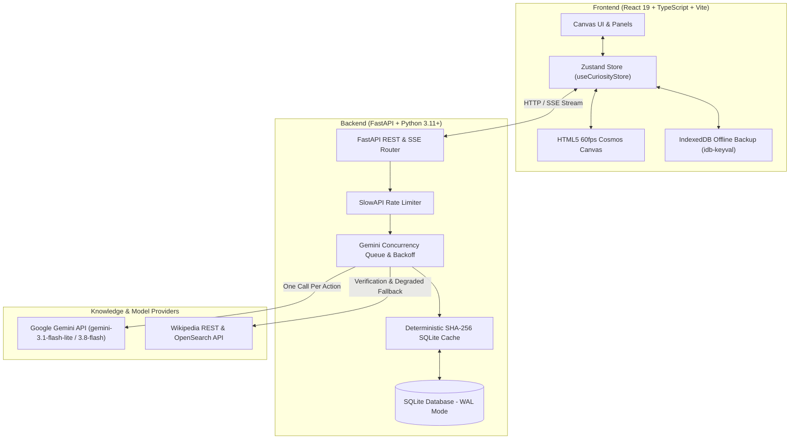

# Curiosity Machine 🌌

[](LICENSE)
[](https://fastapi.tiangolo.com)
[](https://react.dev)
[](https://www.typescriptlang.org)
[](https://python.org)
[](https://ai.google.dev)
[](https://tailwindcss.com)
[](https://sqlite.org)

> **An AI-powered knowledge exploration platform that turns any topic into a living, interactive knowledge universe.**

Curiosity Machine transforms linear text search into a visual, interconnected cosmos of ideas. Users enter any concept they are curious about (e.g., *"octopus intelligence"*, *"quantum entanglement"*, *"why is the sky blue"*), and watch an explorable universe of stars, nebulae, and filaments unfold before their eyes.

Explore deeply, drop into surprising rabbit holes with warp travel, trace conceptual bridges across disciplines, and build a persistent personal curiosity map.

---

## 🌟 Visual Metaphor: "The Observatory"

Curiosity Machine rejects plain node-link graphs and generic text cards in favor of a cosmic charting observatory:

```
┌────────────────────────────────────────────────────────────────────────┐
│ Top Bar: Brand · Breadcrumb Trail · Cmd+K Search · Theme · Profile Card │
├───────────┬────────────────────────────────────────────┬───────────────┤
│ Left Rail │                                            │ Inspector     │
│ (Icons):  │              INFINITE CANVAS               │ (Collapsible) │
│ Explore   │         (Stars, Nebulae, Filaments)        │ Tabs:         │
│ Map View  │                                            │ 🔍 Explain    │
│ Rabbit 🕳 │                         ┌────────────┐     │ 🔗 Connect    │
│ Bridge 🌉 │                         │  Minimap   │     │ 📚 Sources    │
│ Profile 📊│                         └────────────┘     │ 📝 Notes      │
├───────────┴────────────────────────────────────────────┴───────────────┤
│ Trail Strip: Filmstrip of visited stars, click to jump/replay camera   │
└────────────────────────────────────────────────────────────────────────┘
```

- **Concepts as Stars**: Star size represents exploration depth; luminosity reflects recency; unexplored neighbors emit gentle, pulsing signal rings (the *fog of war*).
- **Domains as Nebulae**: Soft blurred color clouds group related concepts into natural knowledge clusters (*Science*, *Nature*, *History*, *Art*, *Tech*, *Math*, *Philosophy*, *Society*).
- **Connections as Threads of Light**: Bézier lines with domain gradient styling encode relational semantics (*causes*, *part of*, *analogous to*, *contrasts with*, *inspired*, *origin of*, *applies to*). Animated particle flows highlight energetic transitions.
- **Comet Trail**: A luminous filmstrip tracks your journey chronologically and replays your path across the sky.
- **Semantic Zoom**:
  - *Galaxy Level (Zoomed Out)*: Macro domain nebulae with cluster labels and boundary hulls.
  - *Constellation Level (Mid Zoom)*: Stars, relationship lines, and concise labels.
  - *Star Level (Zoomed In)*: High-detail focal card with domain chips, depth badges, and summary briefs.
- **Dual Aesthetic Themes**:
  - **Observatory (Dark)**: Deep cosmic void with radial atmosphere, neon filament trails, and glowing starfields.
  - **Atlas (Light)**: Cartographic warm parchment, vintage ink lines, and desaturated natural hues.

---

## 🏗 Architecture & System Design



---

## ✨ Core Capabilities

### 1. Topic → Universe
Deconstructs any prompt into a central root star accompanied by 6–8 rich, high-curiosity concepts. Each connection is strictly typed with relational explanations and surprise scores.

### 2. 4-Stop Depth Lens
Every concept can be explored at four nuanced intellectual depths:
- **Simple**: Plain language, vivid analogies, intuitive mental models.
- **Student**: Core foundations, key terminology, and structural principles.
- **Undergrad**: Technical nuance, scientific/mathematical rigor, and analytical dynamics.
- **Expert**: Frontiers, open problems, counterarguments, and unresolved paradoxes.

Prose streams in real time via Server-Sent Events (SSE) with curiosity prompts (*"What to wonder next"*).

### 3. Rabbit Hole Warp Mode
Discovers distant-yet-factually-connected concepts that maximize **relevance × unexpectedness**.
- Provides 3 curated candidates with teasers and a **Surprise Meter** (0–100%).
- Selecting a rabbit hole triggers **Warp Travel**: the canvas camera smoothly eases across space along a streak effect, settling with a soft arrival pulse.

### 4. Bridge Finder
Select any two distant topics (e.g., *"Bioluminescence"* and *"Artificial Neural Networks"*); Curiosity Machine discovers a factually grounded 3–5 hop narrative path linking the disparate fields step by step.

### 5. Personal Curiosity Map
- Chronological trail recording every node visited.
- Domain filtering pills (*Science*, *Art*, *Philosophy*, etc.).
- Text search across charted stars.
- Starred bookmarks and personal observation notes.
- Dual-synced: persisted on the backend keyed by an anonymous device ID and mirrored locally in IndexedDB for instant offline access.

### 6. Curiosity Profile (Spotify-Wrapped Style)
- Generates an SVG radar chart tracking your domain distribution.
- Computes your explorer archetype:
  - 🌌 **Constellation Weaver**: Balanced explorer across diverse domains.
  - 🏹 **Abyssal Diver**: Deep, focused specialist within a single field.
  - 🧭 **Wide Wanderer**: Broad polymath traversing wide conceptual expanses.
  - 🧪 **Curious Novice**: Newly charting the knowledge cosmos.
- Highlights blind spots and exploration streaks.
- Exports a high-resolution PNG card (`html-to-image`) for sharing.

### 7. Wikipedia Grounding & Degraded Fallback
- Automatically verifies concepts against Wikipedia REST and OpenSearch APIs.
- **Degraded Fallback Mode**: If the Gemini API quota is exhausted, rate-limited, or absent, the platform switches seamlessly to Wikipedia link extraction. The product remains **100% functional and interactive** with zero downtime.

---

## ⌨ Keyboard Shortcuts

| Shortcut | Action |
|---|---|
| <kbd>Cmd</kbd> / <kbd>Ctrl</kbd> + <kbd>K</kbd> | Open Command Palette / Quick Search |
| <kbd>E</kbd> | Expand selected star into new neighbor concepts |
| <kbd>R</kbd> | Open Rabbit Hole Drawer |
| <kbd>B</kbd> | Open Bridge Finder |
| <kbd>F</kbd> | Fit / Center canvas view to entire cosmos |
| <kbd>[</kbd> | Step down one depth level (e.g. Student $\rightarrow$ Simple) |
| <kbd>]</kbd> | Step up one depth level (e.g. Student $\rightarrow$ Undergrad) |
| <kbd>?</kbd> | Open Keyboard Shortcuts modal |
| <kbd>Esc</kbd> | Close active drawer or modal |

---

## 🛠 Tech Stack

### Frontend (`/web`)
- **React 19** + **TypeScript** + **Vite**
- **Tailwind CSS v4** (`@tailwindcss/vite`)
- **Canvas Rendering**: Custom 60fps HTML5 Canvas with D3-Force physics simulation
- **State Management**: **Zustand** with persistent storage
- **Offline Storage**: **IndexedDB** (`idb-keyval`) with runtime fallback
- **Command Palette**: `cmdk`
- **Icons**: `lucide-react`
- **Exporting**: `html-to-image`
- **Testing**: `vitest` + `@testing-library/react` + `jsdom`
- **Linting**: `oxlint`

### Backend (`/api`)
- **Python 3.11+** + **FastAPI**
- **Async Database**: **SQLAlchemy 2.0** + **aiosqlite** (SQLite in WAL mode)
- **Data Validation**: **Pydantic v2** & **Pydantic Settings**
- **AI SDK**: **Google GenAI SDK** (`google-genai`) with support for Gemini 3 Flash / Flash-Lite
- **HTTP Client**: **HTTPX** (async HTTP client for Wikipedia REST API)
- **Rate Limiting**: **SlowAPI** + in-memory concurrency locks + exponential backoff with jitter
- **Testing**: **pytest** + `pytest-asyncio` + `hypothesis`
- **Linting & Typing**: **ruff** + **mypy**

---

## 🚀 Quickstart & Installation

### Prerequisites
- [Python 3.11+](https://www.python.org/downloads/)
- [Node.js 18+](https://nodejs.org/) & npm
- [Git](https://git-scm.com/)

### 1. Clone Repository
```bash
git clone https://github.com/arpansanap1-stack/Curiosity_machine.git
cd Curiosity_machine
```

### 2. Configure Environment
Copy the `.env.example` file to create your `.env`:
```bash
cp .env.example .env
```

Open `.env` in your editor:
```env
# Optional: Free API key from Google AI Studio (https://aistudio.google.com/app/apikey)
# If left blank, Curiosity Machine operates in Wikipedia Degraded Fallback Mode.
GEMINI_API_KEY=your_free_ai_studio_key_here

# Recommended model (gemini-3.1-flash-lite, or gemini-3.8-flash)
GEMINI_MODEL=gemini-3.1-flash-lite

# SQLite Database
DATABASE_URL=sqlite+aiosqlite:///./curiosity.db

# Server configuration
HOST=127.0.0.1
PORT=8000
CORS_ORIGINS=http://localhost:5173,http://127.0.0.1:5173
```

### 3. Start Backend API
```bash
# Install Python dependencies
pip install -r api/requirements.txt

# Start FastAPI server
uvicorn api.app.main:app --reload --host 127.0.0.1 --port 8000
```
- API will be live at: `http://127.0.0.1:8000`
- Interactive Swagger docs: `http://127.0.0.1:8000/docs`

### 4. Start Frontend App
In a new terminal:
```bash
cd web
npm install
npm run dev
```
Open `http://localhost:5173` in your browser.

---

## 📡 API Reference

| Endpoint | Method | Description |
|---|---|---|
| `/api/explore` | `POST` | Generate or fetch root star + 6-8 connected concepts |
| `/api/expand` | `POST` | Expand an existing star into new related neighbors |
| `/api/explain` | `POST` | Retrieve single-call explanation for a node and depth level |
| `/api/explain/stream` | `GET` | SSE stream of node explanation prose and curiosity prompts |
| `/api/rabbit-hole` | `POST` | Find 3 distant-yet-connected concepts with surprise scores |
| `/api/bridge` | `POST` | Find a 3-5 hop narrative path between two distant topics |
| `/api/user/map` | `GET` | Retrieve persistent universe graph for an anonymous device ID |
| `/api/user/profile` | `GET` | Retrieve exploration statistics, domain counts, and archetype |
| `/api/health` | `GET` | Health check, cache stats, and Gemini connection status |

---

## 🧪 Verification & Correctness Protocol

The project enforces strict code quality and type safety:

```bash
# Backend test suite (18 automated tests)
python -m pytest api/tests

# Backend linting & type checks
python -m ruff check api
python -m mypy api

# Frontend test suite (Vitest)
cd web
npm run test

# Frontend linting & production build
npx oxlint
npm run build
```

---

## 🛡 Free-Tier & Rate Limit Discipline

Curiosity Machine is engineered for zero-cost operation on free tiers:
- **1 LLM Call Per User Action**: Strict rule against fanning out calls per click.
- **Deterministic SQLite Caching**: All prompt responses are cached by SHA-256 hash. Cache hits cost 0 API calls and resolve in milliseconds.
- **Lazy Generation**: Explanations and rabbit holes are generated on-demand when inspected.
- **Exponential Backoff with Jitter**: On HTTP 429 or 503 high demand, requests queue and retry automatically.
- **Graceful Error Handling**: Users never see raw stack traces or JSON errors; friendly UI states inform the user when the cosmos is taking a breath.
- **Degraded Fallback**: If quota is completely exhausted, the app seamlessly runs using Wikipedia link graphs.

---

## 🌐 Free-Tier Deployment

- **Frontend**: Deploy on [Vercel](https://vercel.com), [Cloudflare Pages](https://pages.cloudflare.com), or [Netlify]. Set root directory to `web/` and build command to `npm run build`. Set `VITE_API_URL` to your backend URL.
- **Backend**: Deploy on [Render](https://render.com), [Fly.io](https://fly.io), or [Hugging Face Spaces]. Mount a persistent volume for `curiosity.db`.

---

## 📄 License

Distributed under the [MIT License](LICENSE). Built with curiosity.
